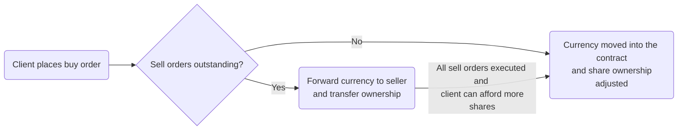

# Tokenized Mutual Fund

All documentation for my UCL MSc CompSci thesis titled "Tokenizing Mutual Funds on the Ethereum Blockchain". 

Developed using the [foundry](https://getfoundry.sh/) toolkit.

## Achievements
The objective of the research was to implement two realistic, fully functioning mutual fund tokens:
* One for a fund with a portfolio of off-chain assets *(src/fund/OffChainFund.sol)*
* One for a fund with a portfolio of on-chain assets *(src/fund/InvestedFund.sol.)*

### Highlights:
1. Off-chain fund guaranteed buyers liquidity 24/7 at NAVPS. Sellers were offered guaranteed liquidity daily and potential liquidity 24/7 again at NAVPS. This was handled by a sell order queue thus facilitating peer to peer trading through the contract (shown below).

2. On-chain fund rebalanced itself according to an investment strategy provided by the fund manager upon contract construction, and guaranteed liqudity to buyers and sellers 24/7 by adjusting investment positions.

*Please find the full thesis in Dissertation.pdf.*